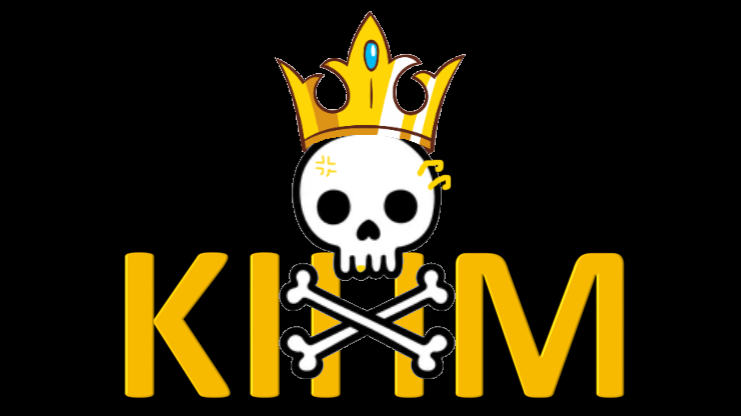

#School Project

This is a school project developped with other students.

For this project, I implemented a A-Star algorithm to find the best path on a map, to develop a visual simulator to test this algorithm and to desrialize and serialize objects to create a Json.
This also allow me to use SonarQube and Github Actions, to automate some tasks in the developpement of this project.

# Qualité et Génie Logiciel - SI3 - 2021-2022 - KIHM

## La famille royale de l'IHM

Le nom d'équipe est <b>La famille royale de l'IHM</b> et le nom du bateau <em> le Royal King </em>

### Liste des Membres
<ul>
<li>Causer Clervie</li>
<li>Herrmann Matis</li>
<li>Chabanier Aurélia</li>
<li>Jeannes Théo</li>
</ul>

### Rapport
Vous pouvez trouver [le rapport](./report_kihm.pdf) que nous avons redigé, au cours de ce projet orienté sur la <b>Qualité du Code</b> et les bonnes pratiques de développement. Le projet est basé sur la [documentation technique](https://github.com/mathiascouste/qgl-2122/tree/master) fournie.

### Player - Cockpit

Vous trouverez dans notre package [player](./player/src/main/java/fr/unice/polytech/si3/qgl/kihm) le code source de notre programme ainsi que les [tests](./player/src/test/java/fr/unice/polytech/si3/qgl/kihm) associés.

### Tooling - Outils

Dans le package [tooling](./tooling/src/main/java/fr/unice/polytech/si3/qgl/kihm/tooling), vous trouverez le [simulateur](./tooling/src/main/java/fr/unice/polytech/si3/qgl/kihm/tooling/Simulator.java), nous permettant de tester notre code sur les courses avant de le soumettre au WebRunner, ainsi qu'une [interface graphique](./tooling/src/main/java/fr/unice/polytech/si3/qgl/kihm/tooling/GUI), permettant de visualiser le bateau à travers les tours, qui affichent toutes les positions du bateau et leurs deplacements. Le contour de tout les obstacles est affiché, et les obstacles visibles par le bateau au tour actuel sont affichés comme remplis. 
